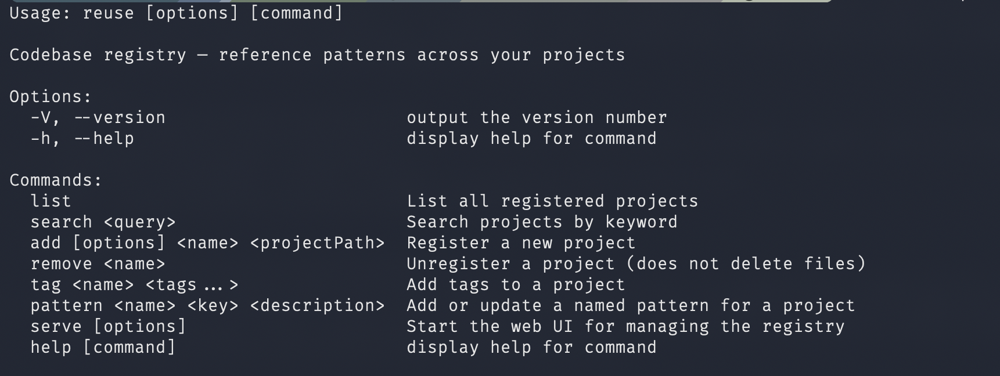
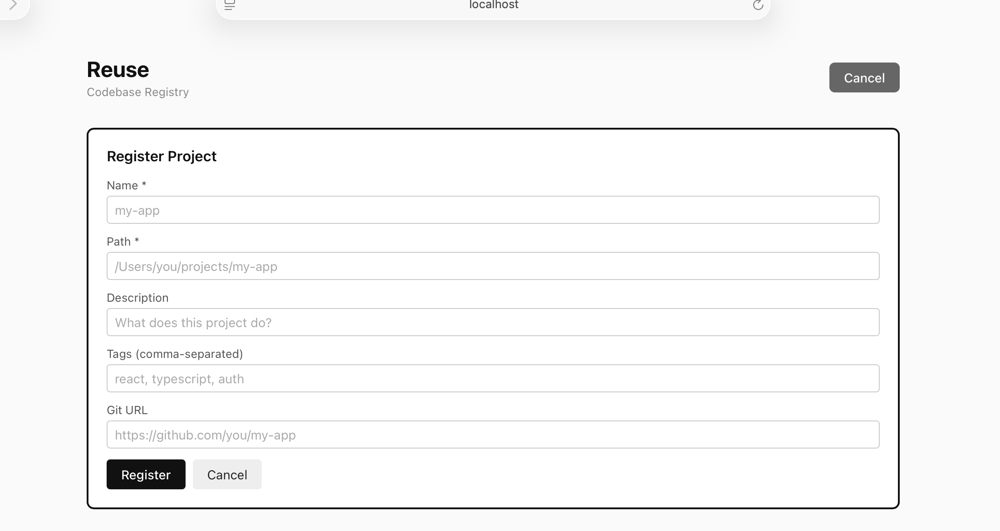
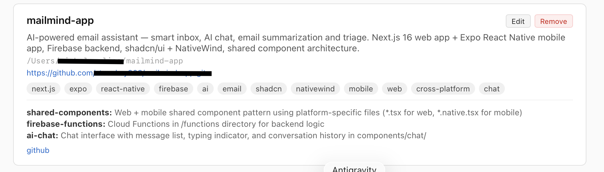
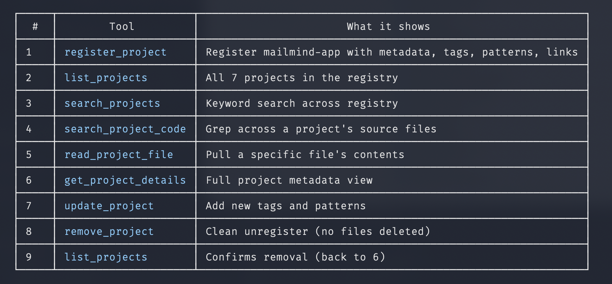
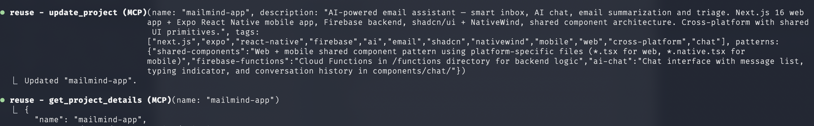
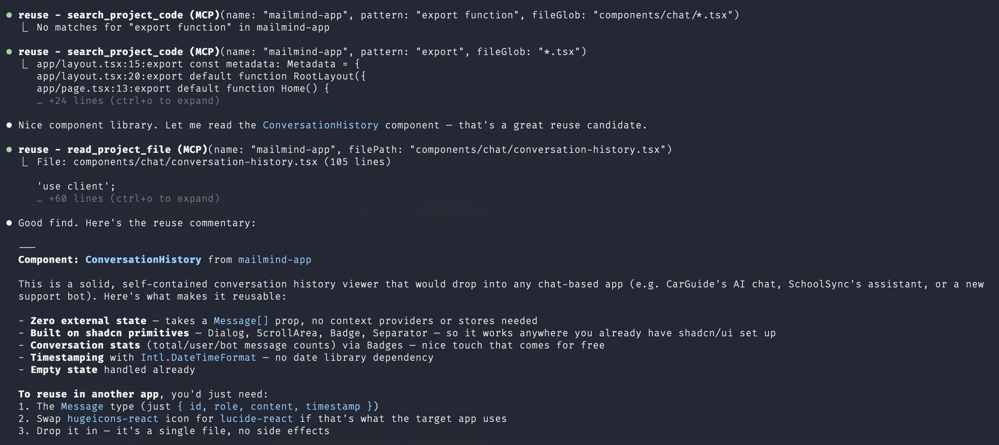

# Reuse

A personal codebase registry that lets AI assistants reference patterns across your projects.

Register your projects with descriptions, tags, and notable patterns. Any MCP-compatible AI assistant can then search your registry, read code from referenced projects, and adapt patterns for your current work.

The AI reads your code to understand the *approach*, then uses its own judgment in the current context. Sometimes it replicates the pattern, sometimes it adapts it, sometimes it says "I see how you did it there, but here's a better fit for this project." It never blindly copies.

## Setup with AI (Recommended)

The easiest way to set up Reuse is to point your AI assistant at this repo and let it help you.

**Claude Code:**
```
Clone https://github.com/stonekey908/reuse and set it up for me.
Install dependencies, build it, link it globally, and add the MCP
server to my global Claude config.
```

**Cursor / Windsurf / any MCP-compatible editor:**
```
Clone https://github.com/stonekey908/reuse, install and build it,
then configure it as an MCP server in my editor settings.
```

The AI will handle cloning, building, and wiring up the MCP config for your specific environment. Once set up, you can immediately start registering projects and asking the AI to reference them.

## Screenshots

### CLI — One command to see everything Reuse can do


### Register a project through the web UI


### Rich project detail view with tags, patterns, and links


### Full MCP tool suite — 9 tools your AI assistant can call


### MCP in action — updating and querying project metadata


### AI-assisted code search and reuse commentary


## Manual Setup

### Prerequisites

- **Node.js** 18+ (`node --version` to check)
- **npm** (`npm --version` to check)
- **Git** (`git --version` to check)

### 1. Clone and build

```bash
git clone https://github.com/stonekey908/reuse.git
cd reuse
npm install
npm run build        # Builds TypeScript server + Vite frontend
```

### 2. Link the CLI globally

```bash
npm link
```

This makes the `reuse` command available in your terminal from any directory.

Verify it works:
```bash
reuse --help
```

You should see the list of commands (list, search, add, remove, tag, pattern, serve).

### 3. Configure the MCP server

The MCP server is what lets AI assistants talk to Reuse. Configuration depends on your client.

#### Claude Code (CLI / Desktop App)

Add to `~/.claude.json` under the top-level `mcpServers` key:

```json
{
  "mcpServers": {
    "reuse": {
      "command": "node",
      "args": ["/FULL/PATH/TO/reuse/dist/mcp/stdio.js"]
    }
  }
}
```

Replace `/FULL/PATH/TO/reuse` with the actual path where you cloned the repo (e.g., `/Users/yourname/reuse`).

Restart Claude Code for the MCP server to load.

#### Claude Desktop

Add to your Claude Desktop config (Settings > Developer > Edit Config):

```json
{
  "mcpServers": {
    "reuse": {
      "command": "node",
      "args": ["/FULL/PATH/TO/reuse/dist/mcp/stdio.js"]
    }
  }
}
```

Restart Claude Desktop.

#### Cursor

Add to `.cursor/mcp.json` in your home directory or project:

```json
{
  "mcpServers": {
    "reuse": {
      "command": "node",
      "args": ["/FULL/PATH/TO/reuse/dist/mcp/stdio.js"]
    }
  }
}
```

#### Windsurf

Add to your Windsurf MCP settings:

```json
{
  "mcpServers": {
    "reuse": {
      "command": "node",
      "args": ["/FULL/PATH/TO/reuse/dist/mcp/stdio.js"]
    }
  }
}
```

#### Any other MCP-compatible client

Reuse uses **stdio transport** — the standard MCP protocol over stdin/stdout. Any client that supports MCP stdio servers can connect. The command is:

```
node /FULL/PATH/TO/reuse/dist/mcp/stdio.js
```

No environment variables or API keys required.

### 4. Verify it works

In your AI assistant, try:

> "List my reuse projects"

If the MCP is connected, the AI will call `list_projects` and show your registry (empty at first).

## Registering Projects

Three ways to add projects — use whichever fits your workflow.

### Via AI (natural language)

Once the MCP is connected, just tell the AI:

> "Register my-app from ~/projects/my-app. It's a React dashboard with real-time WebSocket data and JWT auth."

The AI will call `register_project` with the path, description, and tags it infers. It can also auto-detect the git remote.

> "Find wineanalyzer in my Documents and register it"

The AI will use `find_local_project` to locate the directory, then register it.

### Automatic pattern extraction

When a project is registered *without* patterns, Reuse proactively nudges the AI toward `extract_patterns` — a tool that scouts the project (README, package.json, directory tree, representative source files) and returns a structured scouting report. The AI reads a handful of the suggested files, identifies 5–8 distinctive patterns, and saves them with `update_project`.

> "Add ~/projects/graph-engine to reuse"

Under the hood:

```
1. register_project({ name: "graph-engine", projectPath: "~/projects/graph-engine" })
   → Registered. Nudge: "No patterns supplied — call extract_patterns next."

2. extract_patterns({ name: "graph-engine" })
   → Scouting report: README excerpt, deps, tree, suggestedFilesToRead.

3. read_project_file x3–6 on the most interesting files.

4. update_project({ name: "graph-engine", patterns: { ... } })
   → 5–8 named kebab-case patterns referencing exact file paths.
```

You get proper pattern coverage by default instead of hoping the registering human remembers to write them out. Good patterns make projects searchable by their *distinctive ideas*, not just by their tech stack.

### Via CLI

```bash
# Basic registration
reuse add my-app ~/projects/my-app

# With metadata
reuse add my-app ~/projects/my-app \
  -d "React dashboard with real-time data" \
  -t "react,typescript,websockets,auth"

# Add patterns after registration
reuse pattern my-app auth "JWT with refresh tokens and role-based access"
reuse pattern my-app real-time "WebSocket-based live data feeds with reconnection"

# Add tags
reuse tag my-app nextjs supabase

# Search
reuse search auth
reuse search websocket
```

### Via Web UI

```bash
reuse serve
# Open http://localhost:3210
```

Click "+ Add Project" to register, or click "Edit" on any project to update all fields including path, git URL, patterns, and links. Changes are instant — the same `~/.reuse/registry.json` is used by all three interfaces.

## Using Reuse

Once projects are registered, you use Reuse by talking to your AI assistant naturally:

| What you say | What the AI does |
|---|---|
| "I want file upload like my photos app" | Searches projects for "upload", reads the relevant code, adapts the pattern |
| "Show me how schoolsync handles encryption" | Gets project details, searches for encryption code, reads the files |
| "Build auth like gts-trade but for a mobile app" | Reads the auth pattern from gts-trade, adapts it for React Native |
| "What projects use Supabase?" | Searches tags for "supabase", lists matching projects |
| "Register wine-analyzer from my Documents" | Finds the folder, detects git remote, registers it |

The AI maintains full autonomy. It reads your code to understand the approach, then decides how to apply it. It might:
- Replicate the pattern closely if the stack matches
- Adapt it significantly for a different framework
- Say "I see the approach but there's a better way for this use case"

## MCP Tools Reference

### Read tools (for referencing code)

| Tool | Parameters | Description |
|------|-----------|-------------|
| `list_projects` | — | Browse all registered projects with descriptions, tags, and pattern names |
| `search_projects` | `query` | Search by keyword across names, descriptions, tags, and patterns |
| `get_project_details` | `name` | Full details for a project including file structure overview |
| `search_project_code` | `name`, `pattern`, `fileGlob?` | Search source code within a project (case-insensitive, regex supported) |
| `read_project_file` | `name`, `filePath`, `startLine?`, `endLine?` | Read a file or specific line range (large files return first 500 lines with pagination) |

### Write tools (for managing the registry)

| Tool | Parameters | Description |
|------|-----------|-------------|
| `register_project` | `name`, `projectPath`, `description?`, `tags?`, `patterns?`, `git?`, `links?` | Register a new project (auto-detects git remote). If no patterns are supplied, the response nudges the AI to run `extract_patterns` next. |
| `extract_patterns` | `name` | Scout a registered project for reusable patterns. Returns a structured report (README excerpt, package.json summary, directory tree, representative source files) for the AI to identify 5-8 distinctive patterns. |
| `update_project` | `name`, `description?`, `tags?`, `patterns?`, `git?`, `links?` | Update any metadata field. Patterns merge (existing keys are overwritten). |
| `remove_project` | `name` | Unregister a project (does NOT delete files) |
| `find_local_project` | `name`, `searchIn?` | Search filesystem for a project folder by name |

## CLI Reference

| Command | Description |
|---------|-------------|
| `reuse list` | List all registered projects with metadata |
| `reuse search <query>` | Search projects by keyword |
| `reuse add <name> <path>` | Register a project (`-d` description, `-t` tags, `-g` git URL) |
| `reuse remove <name>` | Unregister a project (no files deleted) |
| `reuse tag <name> <tags...>` | Add tags to a project |
| `reuse pattern <name> <key> <desc>` | Add or update a named pattern |
| `reuse serve [-p port]` | Start the web UI (default port 3210) |

## Web UI

Run `reuse serve` and open `http://localhost:3210`.

- View all registered projects at a glance
- Add new projects with the form
- Edit any field — path, description, tags, git URL, patterns, links
- Remove projects
- The **Analysis** tab clusters patterns across the whole registry by capability and shows a staleness banner when projects change after the last run
- All changes write to the same registry file used by the CLI and MCP

## Analysis & Evals

Reuse can cluster patterns across all your registered projects by capability and surface consolidation opportunities. The analysis runs `claude -p` once with all your patterns inline (no API key needed — uses your logged-in Claude Code CLI). Results are cached to the registry; re-run when patterns change.

```bash
# Analysis
reuse analyze              # cached if fresh, otherwise runs (3-6 min on a full registry)
reuse analyze --refresh    # force a re-run

# Evals (keep the clustering output's quality honest)
reuse eval                 # E1 — snapshot test against a fixture, real claude -p
reuse eval --quality       # E2 — LLM-as-judge, writes a markdown report to eval-results/
```

Or invoke from any Claude Code session via the `analyze_patterns` MCP tool (same registry slot — runs from MCP and from the web UI are interchangeable).

See [`docs/EVALS.md`](docs/EVALS.md) for the rubric, how to read judge reports, and prompt-tuning workflow.

## How It Works

```
You register:
  "schoolsync" → path, description, tags, notable patterns, git, links

AI receives prompt:
  "I want file upload like my photos app"

AI calls Reuse MCP tools:
  1. search_projects("file upload") → finds photos-app
  2. get_project_details("photos-app") → sees the upload pattern description
  3. search_project_code("photos-app", "upload") → finds relevant source files
  4. read_project_file("photos-app", "src/Upload/index.tsx") → reads the actual code
  5. Adapts the approach for the current project's stack and context
```

And during registration:

```
You register a new project:
  "Add ~/projects/graph-engine to reuse"

AI calls Reuse MCP tools:
  1. register_project(...) → registered, nudged to extract patterns
  2. extract_patterns("graph-engine") → scouting report with suggested files
  3. read_project_file x3–6 on the key files
  4. update_project({ name, patterns: {...} }) → 5–8 named patterns saved
```

The AI can also use your other tools alongside Reuse. If a project has a Linear link, the AI can check Linear for related tickets. If it has a Notion link, it can pull docs. Reuse is the index — your other tools provide the depth.

## Registry Format

Projects are stored in `~/.reuse/registry.json`:

```json
{
  "projects": {
    "schoolsync": {
      "path": "/Users/you/schoolsync",
      "description": "School communication app for parents and teachers",
      "tags": ["react-native", "expo", "firebase", "encryption"],
      "patterns": {
        "encryption": "E2E encryption using libsodium for messages and attachments",
        "file-upload": "Chunked upload with progress tracking, retry, and compression"
      },
      "git": "https://github.com/you/schoolsync",
      "links": {
        "linear": "https://linear.app/team/project/schoolsync",
        "figma": "https://figma.com/file/abc123"
      }
    }
  }
}
```

You can edit this file directly if you prefer — it's just JSON.

## Security

- **Scoped access** — the MCP server can only read files from explicitly registered projects, never arbitrary paths
- **Path traversal blocked** — resolved paths must stay within the project directory
- **Smart pagination** — large files (>500 lines) return the first 500 lines with `startLine`/`endLine` support for reading specific sections
- **Read-only project files** — the registry is read/write, but your actual project code is read-only
- **No network** — Reuse never phones home, calls APIs, or sends data anywhere. It's entirely local.
- **No credentials** — no API keys, tokens, or accounts needed

## Troubleshooting

**MCP server not connecting:**
- Check the path in your MCP config points to the actual `dist/mcp/stdio.js` file
- Make sure you ran `npm run build` (or `npm run build:server`) after cloning
- Restart your AI client after changing the MCP config

**`reuse` command not found:**
- Run `npm link` from the reuse directory
- Or use `node /path/to/reuse/dist/cli/index.js` directly

**`reuse serve` fails with `invalid choice: 'serve'`:**
- Debian/Ubuntu (and WSL) ship a `reuse` package (the SPDX license tool) at `/usr/bin/reuse` that shadows this CLI. Check with `which -a reuse`.
- Quickest fix — add an alias to `~/.bashrc` (or `~/.zshrc`):
  ```bash
  alias reuse='node /FULL/PATH/TO/reuse/dist/cli/index.js'
  ```
- Or run the CLI directly: `node /FULL/PATH/TO/reuse/dist/cli/index.js serve`
- Or uninstall the SPDX tool if you don't use it: `sudo apt remove reuse`

**Search returning no results:**
- Reuse searches with a built-in Node.js grep (no external tools required)
- If ripgrep (`rg`) is installed at `/opt/homebrew/bin/rg` or `/usr/local/bin/rg`, it will use that instead for better performance
- Check the project path is correct: `reuse list`

**Web UI won't start:**
- Make sure you built the frontend: `npx vite build` (from the reuse directory)
- Check nothing else is using port 3210: `reuse serve -p 3211`

## License

MIT
